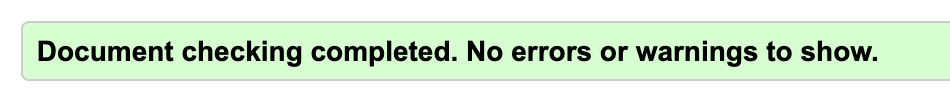

[](https://get.typo3.org/version/12)

# TYPO3 Extension `html5_patch`

EN :This extension patches TYPO3 to eliminate non-HTML5-standard self-closing tags. In this way, the W3C validator will skip the validation steps on `link, meta and input` tags generated in a non-compliant HTML5 way by TYPO3.

FR : Cette extension patche TYPO3 de sorte à éliminer les balises auto-fermantes non normalisées par le HTML5. Ainsi le validator W3C passera les étapes de validation sur les balises `link, meta, input` générées de manière non conformes au HTML5 par TYPO3.




To install this extension you need to run the following command :

```shell
composer require syradev/html5_patch

```

* Then, in your main composer.json you will need to manually add the code below:

```composer.json
"extra": {
    "patches-file": "vendor/syradev/html5_patch/composer.patches.json"
}
```

* Then issue a `composer install` command to apply the patch.


## Syradev © 2025

